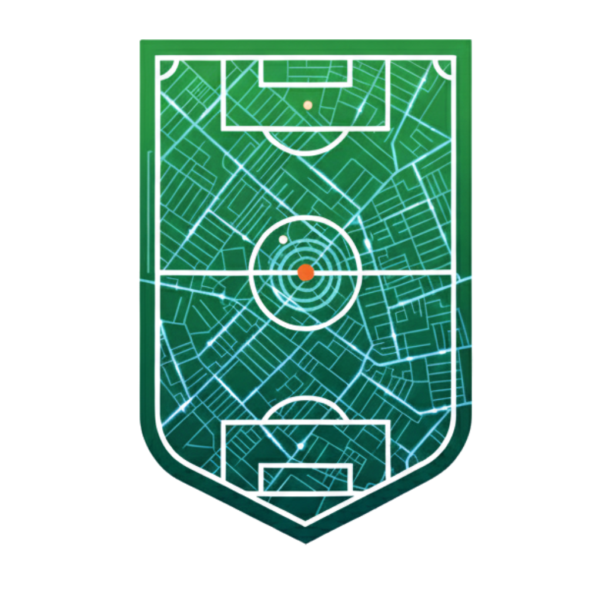

<div align="center">



# ⚽ Geo-Goal

**Plataforma integral de analítica de fútbol amateur con IA**

[](https://geo-goal.onrender.com)
[](https://expo.dev)
[](https://geo-goal-ai-service.onrender.com)
[](https://geo-goal-1.onrender.com)
[](https://neon.tech)

*Convierte un partido amateur en datos de nivel profesional: tracking de jugadores por visión computacional, estadísticas avanzadas (xG, xT, Elo, Dixon-Coles), heatmaps, predicciones y dashboards de carrera — todo en tiempo real desde tu celular.*

---

</div>

## 📌 Tabla de Contenidos

- [Visión General](#-visión-general)
- [Arquitectura del Sistema](#-arquitectura-del-sistema)
- [Módulos del Proyecto](#-módulos-del-proyecto)
  - [Backend — API REST](#-backend--api-rest)
  - [App Móvil](#-app-móvil)
  - [Servicio de IA](#-servicio-de-ia)
  - [Frontend Web](#-frontend-web)
- [Modelos Matemáticos y Analítica](#-modelos-matemáticos-y-analítica)
- [Base de Datos](#-base-de-datos)
- [Flujo Completo de Datos](#-flujo-completo-de-datos)
- [Variables de Entorno](#-variables-de-entorno)
- [Puesta en Marcha Local](#-puesta-en-marcha-local)
- [Despliegue en Producción](#-despliegue-en-producción)
- [Especificaciones Recomendadas](#-especificaciones-recomendadas)

---

## 🌐 Visión General

**Geo-Goal** es una plataforma de analítica deportiva diseñada para ligas de fútbol amateur que no tienen acceso a la tecnología de los equipos profesionales. El sistema integra cuatro capas:

```
📱 App Móvil        →  gestión, dashboards, heatmaps, estadísticas de carrera
🌐 Frontend Web     →  panel de administración de ligas y equipos
🖥️  Backend API      →  lógica de negocio, modelos de datos, notificaciones
🤖 Servicio de IA   →  análisis de video por visión computacional
```

**¿Qué puede hacer Geo-Goal?**

| Capacidad | Descripción |
|---|---|
| 🎥 **Análisis de video** | Procesa un video de partido y detecta, rastrea y clasifica a cada jugador en el campo |
| 📍 **Heatmaps** | Genera mapas de calor 14×21 con la distribución posicional de cada jugador |
| ⚽ **xG & xT** | Calcula Expected Goals y Expected Threat por acción |
| 📊 **Ratings de jugador** | Puntuación dinámica del 1 al 10 por partido basada en contribución posicional |
| 🏆 **Elo y predicciones** | Sistema de ranking de equipos y modelo Dixon-Coles para predecir resultados |
| 📈 **Dashboard de carrera** | Evolución histórica de cada jugador, entrenador y equipo a lo largo de temporadas |
| 🔔 **Notificaciones push** | Alertas de partidos, invitaciones, resultados y premios semanales |
| 🗺️ **Navegación a canchas** | Ruta en tiempo real desde la ubicación del usuario hasta el campo de juego |
| 🏅 **MVP y premios semanales** | Algoritmo de selección automática del mejor jugador de la jornada |

---

## 🏗️ Arquitectura del Sistema

```
┌─────────────────────────────────────────────────────────────────────┐
│                          CLIENTES                                    │
│                                                                      │
│   📱 App Móvil (Expo)          🌐 Frontend Web (React + Vite)       │
│   iOS / Android                Administradores de liga               │
└──────────────┬──────────────────────────────┬───────────────────────┘
               │  HTTPS / REST + JSON         │  HTTPS / REST + JSON
               ▼                              ▼
┌─────────────────────────────────────────────────────────────────────┐
│                   BACKEND — Node.js + TypeScript                     │
│                                                                      │
│  Express · Sequelize ORM · JWT Auth · Multer · node-cron            │
│  Swagger · expo-server-sdk (push) · AWS S3 · Supabase               │
│                                                                      │
│   /api/auth      /api/public     /api/leagues    /api/teams         │
│   /api/admin     /api/account    /api/referee    /api/notifications  │
└──────────────────────────────┬──────────────────────────────────────┘
                               │  M2M JWT · HTTP
                               ▼
┌─────────────────────────────────────────────────────────────────────┐
│              SERVICIO DE IA — Python + FastAPI                       │
│                                                                      │
│  YOLOv8 · ByteTrack · OpenCV · scikit-learn · torch · supervision   │
│                                                                      │
│  Worker asíncrono que procesa videos de partidos                    │
│  Dashboard web de administración (/login · /dashboard)              │
└──────────────────────────────┬──────────────────────────────────────┘
                               │  Sequelize / psycopg2
                               ▼
┌─────────────────────────────────────────────────────────────────────┐
│              BASE DE DATOS — PostgreSQL (NeonDB)                     │
│                                                                      │
│  34+ tablas · JSONB para frames y analytics · índices optimizados   │
└─────────────────────────────────────────────────────────────────────┘
```

---

## 📦 Módulos del Proyecto

### 🖥️ Backend — API REST

> `Geo-Goal_backend/` · Node.js · TypeScript · Express · Sequelize · PostgreSQL

El núcleo de la plataforma. Expone una API REST completa con autenticación JWT, lógica de negocio, acceso a datos y servicios analíticos.

#### Estructura

```
src/
├── routes/
│   ├── authRoutes.ts          # Login, registro, refresh token, logout
│   ├── publicRoutes.ts        # Datos públicos sin auth (ligas, equipos, partidos)
│   ├── accountRoutes.ts       # Perfil, carrera, estadísticas del usuario autenticado
│   ├── leagueRoutes.ts        # CRUD de ligas, temporadas, inscripciones
│   ├── teamRoutes.ts          # CRUD de equipos, plantillas, invitaciones
│   ├── adminRoutes.ts         # Gestión de análisis de video, colas, historial
│   └── notificationRoutes.ts  # Tokens de dispositivo, envío de push
│
├── services/
│   ├── AuthService.ts             # Registro, login, JWT, refresh tokens
│   ├── PlayerCareerService.ts     # Agregación de estadísticas de carrera del jugador
│   ├── TeamCareerService.ts       # Estadísticas históricas del equipo
│   ├── CoachStatsService.ts       # Rendimiento del entrenador por temporada
│   ├── TrackingAnalyticsService.ts# Procesa frames del tracker → estadísticas del partido
│   ├── MatchAnalyticsService.ts   # API de analytics por partido (heatmaps, xG, ratings)
│   ├── EloService.ts              # Sistema de rating Elo entre equipos
│   ├── DixonColesService.ts       # Modelo Poisson bivariado para predicciones
│   ├── XGService.ts               # Expected Goals por regresión logística
│   ├── XTService.ts               # Expected Threat (grid 8×12)
│   ├── PlayerSimilarityService.ts # Similaridad coseno entre perfiles de jugador
│   ├── NotificationService.ts     # Push notifications vía Expo SDK
│   ├── AdminService.ts            # Dashboard de administrador, análisis de video
│   ├── PublicService.ts           # Datos públicos de ligas, equipos y partidos
│   └── NewsService.ts             # Generación automática de noticias
│
├── models/                    # 34+ modelos Sequelize
│   ├── User.ts                # Jugadores, entrenadores, árbitros, admins
│   ├── League.ts · Season.ts  # Ligas y temporadas
│   ├── Team.ts · TeamMember.ts# Equipos y plantillas
│   ├── Match.ts               # Partidos con score, fecha, lugar
│   ├── MatchAnalyticsCache.ts # Cache JSONB de heatmaps y analytics por partido
│   ├── PlayerMatchStat.ts     # Estadísticas individuales por partido
│   ├── TeamMatchStat.ts       # Estadísticas de equipo por partido
│   ├── TeamEloRating.ts       # Historial de Elo por equipo
│   ├── WeeklyAward.ts         # Premios semanales automáticos
│   └── ...
│
├── jobs/                      # Tareas programadas (node-cron)
│   └── weeklyAwards.ts        # Selección automática del MVP de la semana
│
└── middleware/
    ├── auth.ts                # Verificación JWT + control de roles
    └── validate.ts            # Validación con express-validator
```

#### Autenticación y Roles

El sistema maneja **5 roles** con permisos diferenciados:

| Rol | Descripción |
|---|---|
| `player` | Jugador — accede a su carrera, estadísticas y partidos |
| `coach` | Entrenador — gestiona su equipo, alineaciones y resultados |
| `referee` | Árbitro — registra eventos en tiempo real durante el partido |
| `admin` | Administrador — gestiona la liga, sube videos para análisis de IA |
| `guest` | Invitado — solo lectura de datos públicos |

La autenticación usa **JWT de doble token**: `accessToken` de corta vida (15 min) y `refreshToken` de larga vida (7 días) almacenado en base de datos para revocación.

#### Servicios Analíticos

El backend tiene servicios de cálculo que se ejecutan on-demand o al completar un análisis de video:

- **`TrackingAnalyticsService`** — Convierte los frames crudos del tracker (JSON con posiciones de cada jugador por frame) en estadísticas consolidadas: distancia recorrida, velocidad máxima, sprints, posesión, zonas del campo, passes de red, PageRank.
- **`EloService`** — Actualiza el rating Elo de cada equipo después de cada partido con K=30, ventaja local=100 pts y multiplicador logarítmico por diferencia de goles.
- **`DixonColesService`** — Ajusta el modelo Dixon-Coles (Poisson bivariado con corrección τ para marcadores bajos) usando gradiente descendente sobre el historial de partidos.
- **`XGService`** — Calcula Expected Goals vía regresión logística con distancia y ángulo al arco.
- **`XTService`** — Calcula Expected Threat basado en grid precalculado de 8×12 zonas.

---

### 📱 App Móvil

> `Geo-Goal-Movil/` · React Native · Expo SDK 54 · Expo Router · React Query · NativeWind

Aplicación móvil para iOS y Android con arquitectura de navegación en dos niveles:

```
app/
├── (Auth)/                    # Pantallas de autenticación (Stack)
│   ├── login.tsx
│   ├── RegisterView.tsx
│   └── ForgotPasswordView.tsx
│
├── (tabs)/                    # Navegación principal (Tabs)
│   ├── home.tsx               # Dashboard según rol del usuario
│   ├── explore.tsx            # Explorar ligas, equipos, partidos
│   ├── codes.tsx              # Unirse a liga/equipo con código
│   ├── account.tsx            # Perfil y configuración
│   ├── referee.tsx            # Panel del árbitro (solo role=referee)
│   └── public.tsx             # Vista pública (invitados)
│
├── leagueDetail.tsx           # Detalle de liga con clasificación y partidos
├── teamDetail.tsx             # Plantilla, estadísticas y partidos del equipo
├── matchDetail.tsx            # Detalle de partido: eventos, stats, analytics
├── playerCareerDashboard.tsx  # Carrera completa del jugador + heatmap
├── teamCareerDashboard.tsx    # Historial de temporadas del equipo
├── coachCareerDashboard.tsx   # Dashboard del entrenador con ranking y récord
├── adminCareerDashboard.tsx   # Panel del administrador de liga
├── playersList.tsx            # Listado de jugadores con filtros
└── navigation.tsx             # Navegación GPS a la cancha (Google Maps)
```

> **Nota de arquitectura:** Las pantallas de detalle viven en `app/` (root Stack), NO en `app/(tabs)/`. Esto garantiza que el botón Atrás siempre regrese a la pantalla anterior correcta y no al Home.

#### Pantallas por Rol

**Jugador (`player`)**
- Dashboard con próximos partidos, rachas y logros
- Heatmap personal interactivo 14×21
- Estadísticas de carrera: goles, asistencias, rating promedio, xG
- Historial de partidos con estadísticas individuales

**Entrenador (`coach`)**
- Dashboard con clasificación de la liga y récord W/D/L
- Gestión de plantilla y alineaciones
- Estadísticas del equipo y de cada jugador de su equipo

**Árbitro (`referee`)**
- Registro de eventos en tiempo real: goles, tarjetas, sustituciones, faltas
- Telemetría de posición durante el partido

**Administrador (`admin`)**
- Gestión completa de la liga: equipos, partidos, temporadas
- Subida de videos para análisis de IA
- Dashboard de la cola de procesamiento

**Invitado (`guest`)**
- Exploración de ligas y equipos públicos sin cuenta

#### Stack Tecnológico

| Capa | Tecnología |
|---|---|
| Navegación | Expo Router (file-based) |
| Estado de servidor | React Query (TanStack Query) |
| Estilos | NativeWind (Tailwind en RN) |
| Mapas | react-native-maps + Google Maps Directions |
| Notificaciones | expo-notifications |
| Ubicación | expo-location |
| Build | EAS Build (Expo Application Services) |

---

### 🤖 Servicio de IA

> `Geo-Goal_ai_service/` · Python · FastAPI · YOLOv8 · ByteTrack · OpenCV

El cerebro analítico de Geo-Goal. Procesa videos de partidos de fútbol frame a frame usando visión computacional para extraer el posicionamiento de cada jugador y el balón.

#### Pipeline de Procesamiento

```
VIDEO DE PARTIDO (MP4)
         │
         ▼
┌─────────────────────┐
│  1. DETECCIÓN YOLO  │  YOLOv8n detecta jugadores y balón
│     (por frame)     │  Clase 0 = persona, Clase 32 = balón
└────────┬────────────┘
         ▼
┌─────────────────────┐
│  2. TRACKING        │  ByteTrack asigna IDs persistentes
│   ByteTrack         │  entre frames (maneja oclusiones)
└────────┬────────────┘
         ▼
┌─────────────────────┐
│  3. HOMOGRAFÍA      │  Proyección perspectiva pixel → metros
│    OpenCV DLT       │  4 puntos de referencia → H (3×3)
└────────┬────────────┘
         ▼
┌─────────────────────┐
│  4. CLASIFICACIÓN   │  K-Means sobre colores de camiseta
│    de EQUIPOS       │  → home / away / referee / unknown
└────────┬────────────┘
         ▼
┌─────────────────────┐
│  5. INTERPOLACIÓN   │  Kalman filter para frames perdidos
│    de POSICIONES    │  Rellena gaps de hasta 15 frames
└────────┬────────────┘
         ▼
┌─────────────────────┐
│  6. DETECCIÓN DE    │  Detecta: goles, pases, tiros,
│    EVENTOS          │  faltas, fuera de banda, etc.
└────────┬────────────┘
         ▼
┌─────────────────────┐
│  7. EXPORTACIÓN     │  Sube al backend: frames JSON
│    AL BACKEND       │  + eventos + analytics calculados
└─────────────────────┘
```

#### Componentes

| Archivo | Responsabilidad |
|---|---|
| `api.py` | Servidor FastAPI: health check, endpoints de jobs, preview de frame |
| `worker.py` | Worker asíncrono: polling de jobs pendientes y orquestación del pipeline |
| `video_processor.py` | Pipeline completo de CV: YOLO → ByteTrack → homografía → clasificación → exportación |
| `event_detector.py` | Detección automática de 12+ tipos de eventos a partir de snapshots de posición |
| `dashboard.py` | Web UI de administración: login, dashboard de cola, historial de jobs |
| `api_client.py` | Cliente HTTP para comunicación con el backend (auth, status, push de datos) |
| `m2m_client.py` | Autenticación M2M (machine-to-machine) con JWT entre servicios |
| `state.py` | Estado global compartido (worker singleton, variables de configuración) |

#### Dashboard Web de IA

El servicio expone una interfaz web en `/login` → `/dashboard` exclusiva para administradores:

- **Cola de análisis** — jobs pendientes, en proceso y fallidos de sus ligas
- **Estado del worker** — CPU, RAM, GPU, uptime en tiempo real
- **Historial** — todos los análisis completados con métricas
- **Acciones** — forzar poll, reintentar jobs fallidos

#### Modos de Video

El worker soporta tres estrategias para obtener el video, en orden de preferencia:

1. **Archivo local** — el backend y el AI comparten sistema de archivos (desarrollo)
2. **Streaming HTTP** — `cv2.VideoCapture(url)` directo si el MP4 tiene fast-start (sin disco)
3. **Descarga completa** — fallback si el streaming es lento (moov al final del archivo)

---

### 🌐 Frontend Web

> `Geo-Goal_frontend/` · React + Vite · TypeScript · TailwindCSS · React Query

Panel de administración web para gestores de liga y equipos.

```
src/views/
├── Auth/           # Login y registro web
├── Dashboard/      # Panel principal del admin/coach
├── league/         # Gestión de ligas y temporadas
├── team/           # Gestión de equipos y plantillas
├── teams/          # Listado público de equipos
├── players/        # Perfiles de jugadores
├── coaches/        # Perfiles de entrenadores
├── admin/          # Herramientas de administración
├── public/         # Páginas públicas
├── Maps/           # Visualización de canchas en mapa (Leaflet + Google Maps)
├── account/        # Configuración de cuenta
└── shared/         # Componentes compartidos
```

**Librerías de visualización:** Recharts y Victory para gráficas estadísticas, Leaflet + React Leaflet para mapas interactivos de canchas, React Hook Form + Zod para formularios con validación.

---

## 📐 Modelos Matemáticos y Analítica

> Documentación completa: [`MODELOS_MATEMATICOS.md`](MODELOS_MATEMATICOS.md)

### Kernel Density Estimation — Heatmaps

Los heatmaps se generan aplicando un núcleo Gaussiano 2D sobre la grilla 21×14 (columnas × filas):

```
K(r,c) = exp( −[(r−cᵣ)²/(2σᵣ²) + (c−c꜀)²/(2σ꜀²)] )
```

Normalizados a [0, 1] con `valor / máximo`. Cada celda representa aprox. 5m × 4.9m del campo real.

### Expected Goals (xG)

Regresión logística con distancia al arco y ángulo de tiro:

```
xG = 1 / (1 + exp(3.5 − 0.1·dist − 4·ángulo))
```

### Expected Threat (xT)

Grid precalculado de 8×12 zonas. Cada zona tiene un valor de amenaza de 0 a 1 según su cercanía al arco y el historial estadístico de conversiones.

### Sistema Elo

```
Eₐ = 1 / (1 + 10^((Eb − Ea − H) / 400))
ΔElo = K · (resultado − Eₐ) · (ln(|ΔG| + 1) + 1)
```
- K = 30, ventaja local H = 100 pts
- Multiplicador logarítmico evita inflación por goleadas

### Modelo Dixon-Coles (Poisson Bivariado)

Predice distribución de probabilidad de marcadores:

```
P(X=i, Y=j) = τ(i,j) · Poisson(λ, i) · Poisson(μ, j)
λ = αHome · βAway · γ      μ = αAway · βHome
```
- γ ≈ 1.3 (ventaja de local)
- τ = corrección para marcadores 0-0, 1-0, 0-1, 1-1
- Ajuste por gradiente descendente (LR=0.005, 200 iteraciones)

### PageRank de Pases

Red dirigida de pases entre jugadores. PageRank con amortiguación d=0.85 en 50 iteraciones para identificar al jugador más influyente en la construcción del juego.

### Similitud de Jugadores

Distancia coseno sobre vector de 6 dimensiones normalizadas por 90 minutos:

```
similitud = (u · v) / (‖u‖ · ‖v‖)
features = [goles/90, asistencias/90, pases/90, distancia/90, rating, xG/90]
```

---

## 🗄️ Base de Datos

**PostgreSQL (NeonDB)** con 34+ tablas. Tablas clave:

| Tabla | Descripción |
|---|---|
| `users` | Todos los usuarios del sistema con roles |
| `leagues` · `seasons` | Ligas y temporadas con modo de alineación |
| `teams` · `team_members` | Equipos y plantillas con perfiles extendidos |
| `matches` | Partidos con marcador, MVP, formación |
| `match_events` | Goles, tarjetas, sustituciones, faltas |
| `player_match_stats` | Estadísticas individuales por partido |
| `team_match_stats` | Estadísticas de equipo por partido |
| `match_analytics_cache` | **JSONB** — heatmaps 14×21, analytics avanzados por partido |
| `match_tracking_frames` | Frames de posición del tracker (x, y, team por jugador) |
| `match_analysis_jobs` | Cola de procesamiento de video para la IA |
| `team_elo_ratings` | Historial de puntuación Elo por equipo |
| `league_prediction_models` | Parámetros ajustados del modelo Dixon-Coles |
| `weekly_awards` | Premios MVP semanales automáticos |
| `notifications` · `device_tokens` | Sistema de push notifications |
| `user_favorites` · `team_followers` | Sistema de favoritos y seguimiento |

### Estructura del `match_analytics_cache`

```json
{
  "heatmaps": {
    "75": [[0.0, 0.12, 0.45, ...], ...],  // 14 filas × 21 cols por jugador
    "82": [[...]]
  },
  "xg": { "home": 1.82, "away": 0.73 },
  "possession": { "home": 58.3, "away": 41.7 },
  "passNetwork": { "nodes": [...], "edges": [...] },
  "ratings": { "75": 7.4, "82": 6.1 },
  "formation": { "home": "4-3-3", "away": "4-4-2" }
}
```

---

## 🔄 Flujo Completo de Datos

```
1. El árbitro registra eventos en tiempo real → backend almacena en match_events

2. El admin sube el video del partido (MP4) → Supabase Storage

3. El backend crea un MatchAnalysisJob con estado "queued"

4. El worker de IA detecta el job → descarga/stream del video

5. Pipeline CV: YOLO → ByteTrack → Homografía → K-Means → Interpolación

6. Por cada frame procesado:
   ├── Posiciones (x,y) de cada jugador en metros
   ├── Posesión calculada por proximidad al balón (umbral 3m)
   └── Datos empujados al backend cada N frames

7. Al finalizar:
   ├── TrackingAnalyticsService calcula: distancias, velocidades,
   │   sprints, zonas, red de pases, PageRank, xG, xT, ratings
   ├── EloService actualiza ratings de ambos equipos
   ├── DixonColesService recalibra el modelo predictivo de la liga
   └── match_analytics_cache guarda heatmaps y analytics en JSONB

8. La app móvil consulta:
   ├── GET /api/public/matches/:id/analytics  → estadísticas del partido
   ├── GET /api/players/:id/heatmap           → heatmap 14×21 del jugador
   └── GET /api/players/:id/career            → carrera completa agregada
```

---

## 🔐 Variables de Entorno

### Backend (`Geo-Goal_backend/.env`)

```env
DATABASE_URL=postgresql://...@neon.tech/gegoal?sslmode=require
JWT_SECRET=tu_secreto_jwt
JWT_REFRESH_SECRET=tu_secreto_refresh
PORT=4000

# Supabase (almacenamiento de videos)
SUPABASE_URL=https://xxx.supabase.co
SUPABASE_SERVICE_KEY=eyJ...

# M2M (autenticación entre backend y AI service)
M2M_CLIENT_ID=geo-goal-ai
M2M_CLIENT_SECRET=secreto_compartido

# Expo Push Notifications
EXPO_ACCESS_TOKEN=tu_token_expo
```

### App Móvil (`Geo-Goal-Movil/.env`)

```env
EXPO_PUBLIC_API_URL=https://geo-goal.onrender.com/api/
EXPO_PUBLIC_GOOGLE_MAPS_APIKEY=tu_api_key_google_maps
```

### Servicio de IA (`Geo-Goal_ai_service/.env`)

```env
GEO_API_URL=https://geo-goal.onrender.com/api
M2M_CLIENT_ID=geo-goal-ai
M2M_CLIENT_SECRET=secreto_compartido
POLL_INTERVAL_SECONDS=60
YOLO_MODEL=yolov8n.pt
YOLO_DEVICE=cpu           # o "cuda" si hay GPU disponible
ANALYSIS_FRAME_SKIP=4     # procesa 1 de cada 5 frames → ~5 FPS efectivos
EVENTS_MODE=exhaustive    # "exhaustive" o "legacy"
```

---

## 🚀 Puesta en Marcha Local

### Backend

```bash
cd Geo-Goal_backend
npm install
cp .env.example .env        # completar variables
npx sequelize-cli db:migrate
npm run dev                  # Puerto 4000
```

### App Móvil

```bash
cd Geo-Goal-Movil
npm install
cp .env.example .env        # completar variables
npx expo run:android        # build + instalar en dispositivo Android
# o
npx expo run:ios            # build para iOS (requiere macOS + Xcode)
```

### Servicio de IA

```bash
cd Geo-Goal_ai_service
python -m venv .venv
source .venv/bin/activate   # Windows: .venv\Scripts\activate
pip install -r requirements.txt
cp .env.example .env        # completar variables
uvicorn api:app --host 0.0.0.0 --port 8000 --app-dir src --reload
```

### Frontend Web

```bash
cd Geo-Goal_frontend
npm install
cp .env.example .env
npm run dev                  # Puerto 5173
```

---

## ☁️ Despliegue en Producción

| Servicio | Plataforma | URL |
|---|---|---|
| Backend API | Render (Web Service) | `https://geo-goal.onrender.com` |
| Frontend Web | Render (Static Site) | `https://geo-goal-1.onrender.com` |
| AI Service | Render (Web Service) | `https://geo-goal-ai-service.onrender.com` |
| Base de datos | NeonDB (PostgreSQL serverless) | — |
| Almacenamiento de video | Supabase Storage | — |
| App Móvil | EAS Build → APK / TestFlight | — |

### Build de App Móvil

```bash
cd Geo-Goal-Movil

# APK para pruebas (Android)
eas build --platform android --profile preview

# Bundle para Play Store
eas build --platform android --profile production

# IPA para TestFlight (iOS)
eas build --platform ios --profile production
```

---

## ⚙️ Especificaciones Recomendadas — Servicio de IA

El servicio carga **YOLOv8 + PyTorch** en memoria al arrancar. Los requisitos varían según el uso:

| Escenario | RAM | CPU | GPU | Tiempo por partido |
|---|---|---|---|---|
| Solo dashboard (sin procesar) | 2 GB | 1 vCPU | — | — |
| Procesamiento CPU | **8 GB** | 4 vCPU | — | ~20-40 min |
| Procesamiento GPU (recomendado) | **16 GB** | 4 vCPU | NVIDIA T4+ | ~3-5 min |

> En Render.com, el plan **Pro Plus ($225/mo)** es el mínimo viable para procesamiento real. Para GPU, considerar **RunPod** o **AWS EC2 g4dn** bajo demanda para reducir costos.

---

<div align="center">

**Geo-Goal** · Hecho con ⚽ y código

</div>
